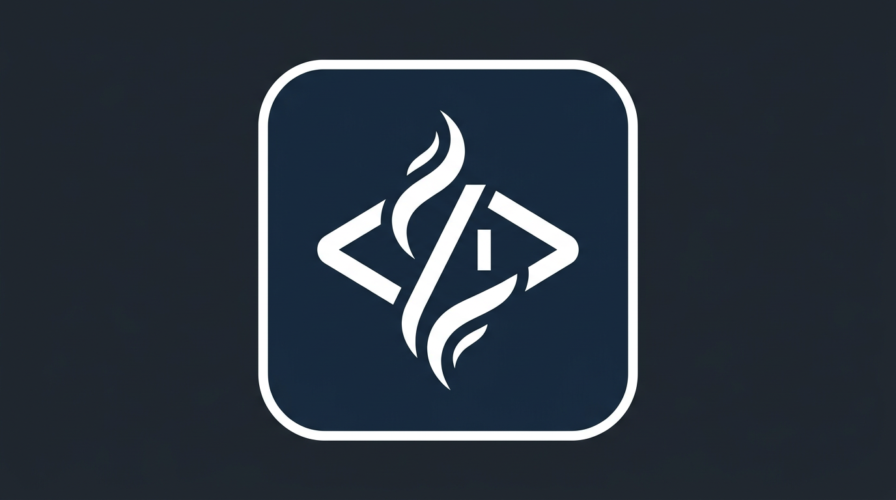

<p align="center">
  
</p>

<h1 align="center">Steam Developer Tools</h1>

<p align="center">
  <em>Steam &amp; Steamworks integration for Cursor IDE - built for game developers and power users.</em>
</p>

<p align="center">
  <a href="LICENSE"></a>
  <a href="CHANGELOG.md"></a>
  <a href="https://github.com/TMHSDigital/Steam-Cursor-Plugin/stargazers"></a>
  <a href="https://github.com/TMHSDigital/Steam-Cursor-Plugin/commits/main"></a>
  <a href="https://github.com/TMHSDigital/Steam-Cursor-Plugin"></a>
  <a href="https://partner.steamgames.com/doc/webapi"></a>
  <a href="https://github.com/sponsors/TMHSDigital"></a>
</p>

---

Query Steam store data, manage Steamworks app configurations, build multiplayer networking, implement cloud saves, design achievements, compare games, and look up player profiles - all from within Cursor's AI chat. 14 skills and 3 rules covering the full Steam &amp; Steamworks ecosystem.

> **No API key required** for most features. Store lookups, player counts, global achievement stats, and app searches all work out of the box.

## Features

### Skills

| Skill | What it does |
|:------|:-------------|
| **Steam Store Lookup** | Look up any Steam game by name or App ID. Returns price, description, tags, reviews, release date, system requirements, and store links. |
| **Steamworks App Config** | Generate and document depot configs, build VDF files, launch options, and DLC setup for Steamworks. |
| **Steam API Reference** | Search Steam Web API and Steamworks SDK documentation. Get endpoint signatures, parameters, auth requirements, and code examples. |
| **Steam Player Stats** | Check current player counts, achievement unlock percentages, leaderboards, playtime data, and user game libraries. |
| **Steam Workshop Helper** | Query Workshop items, get UGC details, and follow integration patterns for adding Workshop support to your game. |
| **Steam Achievement Designer** | Design achievements with proper naming conventions, generate VDF/JSON config files, and get unlock code snippets for C++, C#, and GDScript. |
| **Steam Multiplayer Networking** | Implement lobbies, matchmaking, Steam Networking Sockets (relay), and dedicated game servers with code examples for C++, C#, and GDScript. |
| **Steam Cloud Saves** | Add cloud save support via Auto-Cloud config or ISteamRemoteStorage SDK calls. Covers conflict resolution and quota management. |
| **Steam Leaderboards** | Create leaderboards, upload scores, and download entries (global, friends, around-user) via SDK and Web API. |
| **Steam Friends & Social** | Integrate friends list, rich presence, game invites, Steam Overlay, and avatar/persona retrieval into your game. |
| **Steam Input / Controllers** | Set up Steam Input with action sets, digital/analog bindings, and controller glyph retrieval for Xbox, PlayStation, Switch, and Steam Deck. |
| **Steam Inventory & Economy** | Implement item systems, drops, crafting, the Steam Item Store, and in-game purchases via ISteamInventory and ISteamMicroTxn. |
| **Steam Profile Lookup** | Look up any Steam user's public profile - games, playtime, level, badges, friends, and recent activity. |
| **Steam Game Comparison** | Compare two or more Steam games side by side - price, reviews, player counts, genres, and platforms in a formatted table. |

### Rules

| Rule | What it does |
|:-----|:-------------|
| **App ID Validation** | Checks that Steam App IDs are consistent across your project (`steam_appid.txt`, VDF files, source code) and warns if `steam_appid.txt` is missing. |
| **Steamworks Secrets** | Prevents committing API keys, partner credentials, and auth tokens. Flags sensitive patterns and suggests secure alternatives. |
| **Steam Deck Compatibility** | Flags common Deck compat issues in game code: hardcoded resolutions, mouse-only input, anti-cheat blockers, Windows-only paths, and missing controller support. |

## Quick Start

1. **Install** the plugin from the Cursor marketplace (or [manually](#manual-installation))
2. **Ask** Cursor anything about Steam - try: `What's the current price for Hades?`
3. **Get results** - the plugin fetches live data from Steam's public APIs and formats it for you

That's it. No configuration needed for basic usage.

## Installation

### From the Cursor Marketplace

1. Open Cursor
2. Go to **Settings** > **Plugins**
3. Search for **"Steam Developer Tools"**
4. Click **Install**

### Manual Installation

Clone the repo and symlink it to your local plugins directory:

```bash
git clone https://github.com/TMHSDigital/Steam-Cursor-Plugin.git
```

**Windows (PowerShell as Admin):**
```powershell
New-Item -ItemType SymbolicLink -Path "$env:USERPROFILE\.cursor\plugins\local\steam-cursor-plugin" -Target (Resolve-Path .\Steam-Cursor-Plugin)
```

**macOS / Linux:**
```bash
ln -s "$(pwd)/Steam-Cursor-Plugin" ~/.cursor/plugins/local/steam-cursor-plugin
```

## Usage Examples

Once installed, the plugin's skills are available in Cursor's AI chat. Just ask naturally.

---

### Store Lookup

```
What's the current price and review score for Hollow Knight?
```

```
Look up Steam App ID 1245620
```

---

### Steamworks Configuration

```
Set up Steam build configs for my game. App ID is 2345678, Windows and Linux only.
```

```
How do I configure DLC depots in Steamworks?
```

---

### API Reference

```
How do I get a list of achievements from the Steam API?
```

```
What parameters does ISteamUserStats/GetUserStatsForGame accept?
```

---

### Player Stats

```
How many people are playing Elden Ring right now?
```

```
What are the rarest achievements in Celeste?
```

---

### Workshop

```
I want to add Workshop support to my Unity game. How do I handle uploads and downloads?
```

```
Get details for Workshop item 1234567890
```

---

### Achievement Design

```
I need achievements for my platformer. Milestones: complete tutorial, beat each world, collect all coins, speedrun under 2 hours.
```

```
Generate a VDF achievement config for my game with these achievements: [list]
```

---

### Multiplayer Networking

```
How do I set up Steam lobbies for a 4-player co-op game?
```

```
Show me Steam Networking Sockets setup for P2P relay connections.
```

---

### Cloud Saves

```
I want to add cloud saves to my roguelike. I have a single save file in AppData/Local.
```

```
Help me configure Auto-Cloud for cross-platform save syncing.
```

---

### Leaderboards

```
My speedrun game needs a leaderboard for each level. Times in ms, lower is better.
```

```
How do I download and display friends-only leaderboard entries?
```

---

### Friends & Social

```
I want to show "Playing as [Character] on [Map]" in the Steam friends list.
```

```
How do I send game invites to friends from within my game?
```

---

### Controllers & Steam Deck Input

```
My platformer has move, jump, dash, and pause. Set up Steam Input for Xbox and Steam Deck.
```

```
How do I show the correct button glyphs for whichever controller the player is using?
```

---

### Inventory & Economy

```
I want cosmetic hat drops every 2 hours of playtime, plus a Steam Item Store for direct purchases.
```

```
Walk me through the ISteamMicroTxn InitTxn/FinalizeTxn flow.
```

---

### Profile Lookup

```
Look up the Steam profile for vanity URL "gaben"
```

```
What are my most played games on Steam?
```

---

### Game Comparison

```
Compare Hades, Dead Cells, and Hollow Knight - price, reviews, and current players.
```

```
Compare App IDs 570 and 730 side by side.
```

## Configuration

### Steam API Key

Some features (player stats, user data, workshop queries) require a Steam Web API key.

1. Get a free key at [steamcommunity.com/dev/apikey](https://steamcommunity.com/dev/apikey)
2. Set it as an environment variable:

<details>
<summary><strong>Platform-specific setup</strong></summary>

**Windows (PowerShell):**
```powershell
$env:STEAM_API_KEY = "your_key_here"
```

**macOS / Linux:**
```bash
export STEAM_API_KEY="your_key_here"
```

**Persistent (`.env` file in your project):**
```
STEAM_API_KEY=your_key_here
```

</details>

The plugin's **Steamworks Secrets** rule will warn you if it detects an API key hardcoded in your source files.

### No-Key Features

These work immediately without any API key:

- Store lookups (price, description, reviews, system requirements)
- Game comparisons (side-by-side analysis)
- Current player counts
- Global achievement unlock percentages
- App and game searches

## Roadmap

See [ROADMAP.md](ROADMAP.md) for the full themed release plan (v0.2.0 through v1.0.0).

| Version | Theme | Highlights |
|---------|-------|------------|
| **v0.2.0** | Live Data | Steam MCP server with 10 read-only tools, skill updates |
| **v0.3.0** | Insights | Review analysis, price history, market research, wishlist estimates |
| **v0.4.0** | Ship It | CI/CD automation, release checklist, steamcmd helper, build validation rules |
| **v0.5.0** | Grow | Community management, store page optimization, pricing strategy, DLC planning |
| **v0.6.0** | Quality | Playtest setup, anti-cheat integration, save compat / network security / error handling rules |
| **v0.7.0** | Full Power | MCP write operations (lobbies, workshop uploads, achievements, inventory) |
| **v0.8.0** | Polish | Cross-references, troubleshooting sections, migration guide |
| **v1.0.0** | Stable | Production release: 30 skills, 9 rules, 20 MCP tools |

## Contributing

See [CONTRIBUTING.md](CONTRIBUTING.md) for guidelines on how to contribute skills, rules, and improvements.

## Support

If this plugin is useful to you, consider [sponsoring the project](https://github.com/sponsors/TMHSDigital).

## License

CC BY-NC-ND 4.0 - see [LICENSE](LICENSE) for details.

<details>
<summary><strong>Steam API Reference Links</strong></summary>

- [Steam Web API Overview](https://partner.steamgames.com/doc/webapi)
- [Steamworks SDK Reference](https://partner.steamgames.com/doc/api)
- [Store API (appdetails)](https://wiki.teamfortress.com/wiki/User:RJackson/StorefrontAPI)
- [Steamworks Partner Documentation](https://partner.steamgames.com/doc/home)
- [Steam Workshop Implementation](https://partner.steamgames.com/doc/features/workshop)

</details>

---

<p align="center">
  Built by <a href="https://github.com/TMHSDigital">TMHSDigital</a>
</p>
