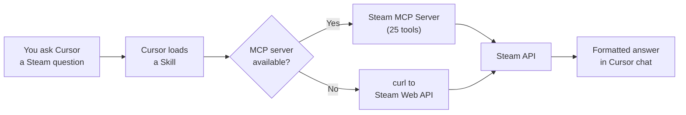

<p align="center">
  
</p>

<h1 align="center">Steam Developer Tools</h1>

<p align="center">
  <em>Steam &amp; Steamworks integration for Cursor IDE - built for game developers and power users.</em>
</p>

<p align="center">
  <a href="https://github.com/TMHSDigital/Steam-Cursor-Plugin/actions/workflows/validate.yml"></a>
  <a href="LICENSE"></a>
  <a href="CHANGELOG.md"></a>
  <a href="https://www.npmjs.com/package/@tmhs/steam-mcp"></a>
  <a href="https://www.npmjs.com/package/@tmhs/steam-mcp"></a>
  <a href="https://github.com/TMHSDigital/Steam-Cursor-Plugin/stargazers"></a>
  <a href="https://github.com/TMHSDigital/Steam-Cursor-Plugin/commits/main"></a>
  <a href="https://github.com/TMHSDigital/Steam-Cursor-Plugin"></a>
  <a href="https://partner.steamgames.com/doc/webapi"></a>
  <a href="https://github.com/sponsors/TMHSDigital"></a>
</p>

---

<p align="center">
  <strong>30 skills</strong> &nbsp;&bull;&nbsp; <strong>9 rules</strong> &nbsp;&bull;&nbsp; <strong>25 MCP tools</strong>
</p>

Query Steam store data, manage Steamworks app configurations, build multiplayer networking, implement cloud saves, design achievements, compare games, and look up player profiles — all from within Cursor's AI chat. Covers the full Steam &amp; Steamworks ecosystem with live data via the companion [Steam MCP Server](https://github.com/TMHSDigital/steam-mcp).

> **No API key required** for most features. Store lookups, player counts, global achievement stats, and app searches all work out of the box.

## Quick Start

1. **Install** the plugin ([see below](#installation))
2. **Ask** Cursor anything about Steam:

```
What's the current price and review score for Hollow Knight?
```
```
How many people are playing Elden Ring right now?
```
```
Compare Hades, Dead Cells, and Hollow Knight — price, reviews, and current players.
```

3. **Get results** — the plugin fetches live data from Steam's APIs and formats it in chat

That's it. No configuration needed for basic usage.

## How It Works



**Skills** teach Cursor how to handle Steam-related prompts. **Rules** enforce best practices in your game project files. The **MCP server** provides live, structured API access so skills can fetch real data instead of relying on shell commands.

## Features

<details open>
<summary><strong>Skills (30)</strong></summary>

&nbsp;

<table>
<tr><th>Category</th><th>Skill</th><th>What it does</th></tr>
<tr><td rowspan="5"><strong>Core SDK</strong></td>
  <td>Steam Store Lookup</td><td>Look up any game by name or App ID — price, tags, reviews, platforms, system requirements</td></tr>
<tr><td>Steamworks App Config</td><td>Generate depot configs, build VDF files, launch options, DLC setup</td></tr>
<tr><td>Steam API Reference</td><td>Search Web API and SDK docs — endpoint signatures, parameters, auth, code examples</td></tr>
<tr><td>Steam Testing Sandbox</td><td>App ID 480 (SpaceWar) sandbox, test accounts, Steam console commands, dev workflow</td></tr>
<tr><td>Steam Migration Guide</td><td>Migrate from Epic/GOG/itch.io to Steam — Unity, Unreal, Godot SDK integration</td></tr>
<tr><td rowspan="6"><strong>Game Features</strong></td>
  <td>Steam Achievement Designer</td><td>Design achievements, generate VDF/JSON configs, get unlock code (C++/C#/GDScript)</td></tr>
<tr><td>Steam Multiplayer Networking</td><td>Lobbies, matchmaking, Steam Networking Sockets, dedicated servers</td></tr>
<tr><td>Steam Cloud Saves</td><td>Auto-Cloud config and ISteamRemoteStorage SDK — conflict resolution, quotas</td></tr>
<tr><td>Steam Leaderboards</td><td>Create leaderboards, upload scores, download entries (global/friends/around-user)</td></tr>
<tr><td>Steam Input / Controllers</td><td>Action sets, bindings, controller glyphs for Xbox, PlayStation, Switch, Steam Deck</td></tr>
<tr><td>Steam Inventory & Economy</td><td>Item drops, crafting, Steam Item Store, ISteamMicroTxn</td></tr>
<tr><td rowspan="3"><strong>Social</strong></td>
  <td>Steam Friends & Social</td><td>Friends list, rich presence, game invites, overlay, avatars</td></tr>
<tr><td>Steam Profile Lookup</td><td>Player profiles — games, playtime, level, badges, friends, activity</td></tr>
<tr><td>Steam Workshop Helper</td><td>Workshop item queries, UGC integration patterns, upload workflow</td></tr>
<tr><td rowspan="4"><strong>Analytics</strong></td>
  <td>Steam Player Stats</td><td>Player counts, achievement rates, playtime data, game libraries</td></tr>
<tr><td>Steam Game Comparison</td><td>Side-by-side comparison — price, reviews, players, genres, platforms</td></tr>
<tr><td>Steam Review Analysis</td><td>Sentiment breakdown, common complaints, update comparisons, review bombs</td></tr>
<tr><td>Steam Wishlist Estimates</td><td>Boxleiter method, conversion rates, revenue projections</td></tr>
<tr><td rowspan="3"><strong>Market</strong></td>
  <td>Steam Price History</td><td>Pricing trends, sale history, regional pricing, value scoring</td></tr>
<tr><td>Steam Market Research</td><td>Genre trends, tag popularity, competitor analysis, market gaps</td></tr>
<tr><td>Steam Pricing Strategy</td><td>Base pricing, regional tiers, launch discounts, bundles, F2P</td></tr>
<tr><td rowspan="4"><strong>Publish</strong></td>
  <td>Steam Build Automation</td><td>SteamPipe CI/CD — GitHub Actions, GitLab CI, Jenkins, Docker, beta branches</td></tr>
<tr><td>Steam Release Checklist</td><td>Pre-release validation — store page, depots, achievements, Deck, pricing</td></tr>
<tr><td>Steam SteamCMD Helper</td><td>steamcmd scripting, Docker builds, Steam Guard, troubleshooting</td></tr>
<tr><td>Steam Store Page Optimizer</td><td>Capsule specs, description structure, tags, trailers, demos, screenshots</td></tr>
<tr><td rowspan="3"><strong>Grow</strong></td>
  <td>Steam Community Management</td><td>Announcements, events, forums, update posts, Community Hub config</td></tr>
<tr><td>Steam DLC & Expansion Planning</td><td>DLC roadmap, season passes, content cadence, pricing tiers</td></tr>
<tr><td>Steam Playtest Setup</td><td>Open/closed playtests, key distribution, signups, Next Fest integration</td></tr>
<tr><td rowspan="2"><strong>Quality</strong></td>
  <td>Steam Bug Report Template</td><td>Structured templates, steam://sysinfo, crash dumps, known issues</td></tr>
<tr><td>Steam Anti-Cheat Integration</td><td>EAC, BattlEye, VAC — Proton/Deck compat, server-side validation</td></tr>
</table>

</details>

<details>
<summary><strong>Rules (9)</strong></summary>

&nbsp;

| Rule | What it does |
|:-----|:-------------|
| **App ID Validation** | Checks App ID consistency across `steam_appid.txt`, VDF files, and source code. Warns if `480` (SpaceWar test app) appears in production. Suggests MCP live validation. |
| **Steamworks Secrets** | Flags API keys, partner credentials, auth tokens, ssfn files, DRM keys. Suggests secure alternatives. |
| **Steam Deck Compatibility** | Flags hardcoded resolutions, mouse-only input, anti-cheat blockers, Windows paths, missing controller support. |
| **MCP Tool Preference** | Flags raw `curl`/`fetch` calls to Steam APIs when the MCP server is available. Suggests equivalent tools. |
| **Build Config Validation** | Validates VDF configs: missing depots, mismatched App IDs, invalid file mappings, `setlive` safety. |
| **Launch Options Check** | Flags missing executables, wrong OS targeting, missing descriptions, invalid type values. |
| **Save File Compatibility** | Flags cross-platform issues: binary endianness, OS-specific paths, non-portable serialization. |
| **Network Security** | Flags unvalidated auth tickets, trusting client data, missing encryption, deprecated APIs. |
| **API Error Handling** | Flags unchecked `SteamAPI_Init()`, missing `StoreStats()`, ignored callbacks, missing `RunCallbacks()`. |

</details>

## Companion: Steam MCP Server

[](https://www.npmjs.com/package/@tmhs/steam-mcp) [](https://www.npmjs.com/package/@tmhs/steam-mcp) [](https://github.com/TMHSDigital/Steam-MCP/stargazers)

The [Steam MCP Server](https://github.com/TMHSDigital/steam-mcp) provides live, structured API tools that Cursor can call directly — no shell commands needed.

<details open>
<summary><strong>Setup</strong></summary>

&nbsp;

**Requires [Node.js](https://nodejs.org/) v18+.** Add to `.cursor/mcp.json`:

```json
{
  "mcpServers": {
    "steam": {
      "command": "npx",
      "args": ["-y", "@tmhs/steam-mcp"],
      "env": {
        "STEAM_API_KEY": "your_key_here"
      }
    }
  }
}
```

`STEAM_API_KEY` is only needed for user-specific tools (player summaries, owned games, workshop queries, leaderboards). Store lookups, player counts, and achievement stats work without a key.

</details>

<details>
<summary><strong>Available Tools (25)</strong></summary>

&nbsp;

**Read-only (no auth) — 10 tools:**

| Tool | Description |
|------|-------------|
| `steam_getAppDetails` | Store data — price, reviews, tags, platforms |
| `steam_searchApps` | Search the Steam store by name |
| `steam_getPlayerCount` | Current concurrent players |
| `steam_getAchievementStats` | Global achievement unlock percentages |
| `steam_getWorkshopItem` | Workshop item details |
| `steam_getReviews` | User reviews with filters for language, sentiment, purchase type |
| `steam_getPriceOverview` | Batch price check for multiple apps in a region |
| `steam_getAppReviewSummary` | Review score, totals, and positive percentage |
| `steam_getRegionalPricing` | Pricing breakdown across multiple countries |
| `steam_getNewsForApp` | Recent news and announcements for a game |

**Read-only (API key) — 7 tools:**

| Tool | Description |
|------|-------------|
| `steam_getPlayerSummary` | Player profile — name, avatar, status |
| `steam_getOwnedGames` | Game library with playtime |
| `steam_queryWorkshop` | Search/browse Workshop items |
| `steam_getLeaderboardEntries` | Leaderboard scores and rankings |
| `steam_resolveVanityURL` | Convert vanity URL to Steam ID |
| `steam_getSchemaForGame` | Achievement/stat schema with display names and icons |
| `steam_getPlayerAchievements` | Per-player achievement unlock status and timestamps |

**Write / guidance (publisher key):**

| Tool | Type | Description |
|------|------|-------------|
| `steam_createLobby` | SDK guide | Code examples for ISteamMatchmaking lobby creation |
| `steam_uploadWorkshopItem` | SDK guide | Code examples for ISteamUGC Workshop uploads |
| `steam_updateWorkshopItem` | HTTP POST | Update Workshop item metadata via partner API |
| `steam_setAchievement` | HTTP POST | Set/unlock achievements (dev/test) |
| `steam_clearAchievement` | HTTP POST | Clear/re-lock achievements (dev/test) |
| `steam_uploadLeaderboardScore` | HTTP POST | Upload leaderboard scores |
| `steam_grantInventoryItem` | HTTP POST | Grant inventory items |
| `steam_getLeaderboardsForGame` | HTTP GET | List all leaderboards with numeric IDs |

</details>

## Installation

> **Marketplace listing pending review.** Use manual installation in the meantime.

Clone the repo and symlink it to your local plugins directory:

```bash
git clone https://github.com/TMHSDigital/Steam-Cursor-Plugin.git
```

<details>
<summary><strong>Windows (PowerShell as Admin)</strong></summary>

```powershell
New-Item -ItemType SymbolicLink -Path "$env:USERPROFILE\.cursor\plugins\local\steam-cursor-plugin" -Target (Resolve-Path .\Steam-Cursor-Plugin)
```

</details>

<details>
<summary><strong>macOS / Linux</strong></summary>

```bash
ln -s "$(pwd)/Steam-Cursor-Plugin" ~/.cursor/plugins/local/steam-cursor-plugin
```

</details>

<details>
<summary><strong>Usage examples (all 30 skills)</strong></summary>

&nbsp;

**Store Lookup**
```
Look up Steam App ID 1245620
```

**Steamworks Configuration**
```
Set up Steam build configs for my game. App ID is 2345678, Windows and Linux only.
```

**API Reference**
```
What parameters does ISteamUserStats/GetUserStatsForGame accept?
```

**Player Stats**
```
What are the rarest achievements in Celeste?
```

**Workshop**
```
I want to add Workshop support to my Unity game. How do I handle uploads and downloads?
```

**Achievement Design**
```
I need achievements for my platformer. Milestones: complete tutorial, beat each world, collect all coins, speedrun under 2 hours.
```

**Multiplayer Networking**
```
How do I set up Steam lobbies for a 4-player co-op game?
```

**Cloud Saves**
```
I want to add cloud saves to my roguelike. I have a single save file in AppData/Local.
```

**Leaderboards**
```
My speedrun game needs a leaderboard for each level. Times in ms, lower is better.
```

**Friends & Social**
```
I want to show "Playing as [Character] on [Map]" in the Steam friends list.
```

**Controllers & Steam Deck Input**
```
My platformer has move, jump, dash, and pause. Set up Steam Input for Xbox and Steam Deck.
```

**Inventory & Economy**
```
I want cosmetic hat drops every 2 hours of playtime, plus a Steam Item Store for direct purchases.
```

**Profile Lookup**
```
Look up the Steam profile for vanity URL "gaben"
```

**Game Comparison**
```
Compare App IDs 570 and 730 side by side.
```

**Review Analysis**
```
Analyze recent reviews for Baldur's Gate 3. Are players happy with the latest patches?
```

**Price History**
```
What's the pricing history for Hades? Is it a good deal right now?
```

**Market Research**
```
I'm thinking about making a cozy farming sim. Is the market too saturated?
```

**Wishlist Estimates**
```
My game has 25,000 wishlists two weeks before launch. What should I expect for sales?
```

**Build Automation**
```
Set up GitHub Actions to automatically upload my Unity game to Steam when I push a version tag. App ID 2345678.
```

**Release Checklist**
```
I'm about to launch my game on Steam. App ID 2345678. What do I need to check?
```

**SteamCMD**
```
I need a script to download and update a CS2 dedicated server on Linux.
```

**Community Management**
```
I just released a big content update. Help me write patch notes and set up an announcement.
```

**Store Page Optimization**
```
I need to set up my Steam store page. The game is a pixel art metroidvania. What do I need?
```

**Pricing Strategy**
```
I'm launching a roguelike deckbuilder. 15-20 hours of content. How should I price it?
```

**DLC Planning**
```
I want to plan 3 DLC packs and a season pass for my roguelike. Base game App ID is 2345678.
```

**Playtest Setup**
```
I want to run a closed playtest for my game before Early Access. How do I set it up?
```

**Bug Reporting**
```
I need to set up bug reporting for my game. Players keep submitting vague reports.
```

**Anti-Cheat**
```
I'm making a competitive FPS. I need anti-cheat that works on Steam Deck. What should I use?
```

**Testing Sandbox**
```
I want to test Steam achievements in my game but I don't have an App ID yet. How do I get started?
```

**Migration Guide**
```
I have a game on itch.io built with Godot. I want to bring it to Steam with achievements and cloud saves.
```

</details>

## Configuration

<details>
<summary><strong>Steam API Key setup</strong></summary>

&nbsp;

Some features (player stats, user data, workshop queries) require a Steam Web API key.

1. Get a free key at [steamcommunity.com/dev/apikey](https://steamcommunity.com/dev/apikey)
2. Set it as an environment variable:

**Windows (PowerShell):**
```powershell
$env:STEAM_API_KEY = "your_key_here"
```

**macOS / Linux:**
```bash
export STEAM_API_KEY="your_key_here"
```

**Persistent (`.env` file in your project):**
```
STEAM_API_KEY=your_key_here
```

The plugin's **Steamworks Secrets** rule will warn you if it detects an API key hardcoded in your source files.

</details>

**No-key features** — these work immediately without configuration:

- Store lookups (price, description, reviews, system requirements)
- Game comparisons (side-by-side analysis)
- Current player counts
- Global achievement unlock percentages
- App and game searches

## Roadmap

See [ROADMAP.md](ROADMAP.md) for the full themed release plan toward v1.0.0.

<details>
<summary><strong>Release history</strong></summary>

&nbsp;

| Version | Theme | Highlights | Status |
|---------|-------|------------|--------|
| **v0.1.0** | Foundation | 14 skills, 3 rules, plugin scaffold | Done |
| **v0.2.0** | Live Data | Steam MCP server with 10 read-only tools, skill updates | Done |
| **v0.3.0** | Insights | Review analysis, price history, market research, wishlist estimates | Done |
| **v0.4.0** | Ship It | CI/CD automation, release checklist, steamcmd helper, build validation rules | Done |
| **v0.5.0** | Grow | Community management, store page optimization, pricing strategy, DLC planning | Done |
| **v0.6.0** | Quality | Playtest setup, bug reporting, anti-cheat, save compat / network security / error handling rules | Done |
| **v0.7.0** | Full Power | Testing sandbox, 6 MCP write tools (lobbies, workshop, achievements, leaderboards, inventory) | Done |
| **v0.8.0** | Polish | Migration guide, common pitfalls across all 30 skills | Done |
| **v0.9.0** | Complete | 4 new MCP read tools (reviews, pricing, regional) — 20 MCP tools at release | **Current** |
| v1.0.0 | Stable | Production release: 30 skills, 9 rules, 25 MCP tools | Planned |

</details>

## Contributing

See [CONTRIBUTING.md](CONTRIBUTING.md) for guidelines on adding skills, rules, and improvements.

## Support

If this plugin is useful to you, consider [sponsoring the project](https://github.com/sponsors/TMHSDigital).

## License

CC BY-NC-ND 4.0 — see [LICENSE](LICENSE) for details.

<details>
<summary><strong>Steam API reference links</strong></summary>

&nbsp;

- [Steam Web API Overview](https://partner.steamgames.com/doc/webapi)
- [Steamworks SDK Reference](https://partner.steamgames.com/doc/api)
- [Store API (appdetails)](https://wiki.teamfortress.com/wiki/User:RJackson/StorefrontAPI)
- [Steamworks Partner Documentation](https://partner.steamgames.com/doc/home)
- [Steam Workshop Implementation](https://partner.steamgames.com/doc/features/workshop)

</details>

---

<p align="center">
  Built by <a href="https://github.com/TMHSDigital">TMHSDigital</a>
</p>
